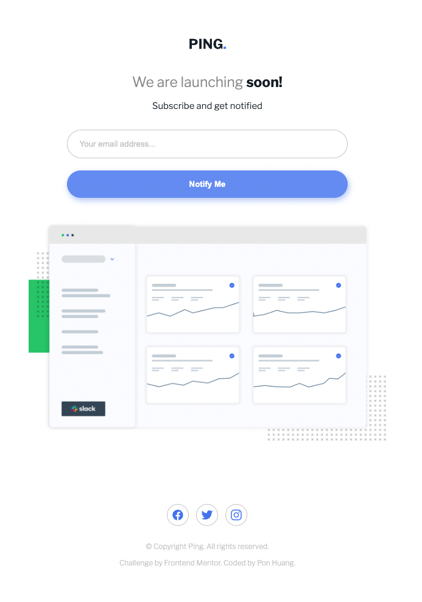
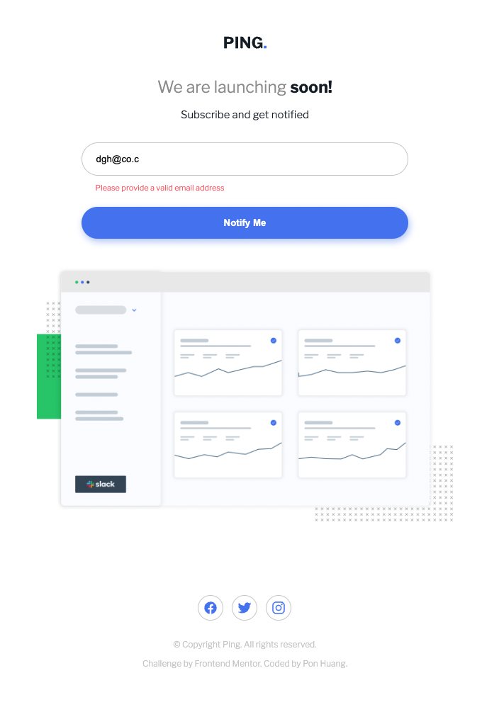

# Frontend Mentor - Ping coming soon page solution

This is a solution to the [Ping coming soon page challenge on Frontend Mentor](https://www.frontendmentor.io/challenges/ping-single-column-coming-soon-page-5cadd051fec04111f7b848da). Frontend Mentor challenges help you improve your coding skills by building realistic projects.

## Table of contents

- [Overview](#overview)
  - [The challenge](#the-challenge)
  - [Screenshot](#screenshot)
  - [Links](#links)
- [My process](#my-process)
  - [Built with](#built-with)
  - [What I learned](#what-i-learned)
  - [Continued development](#continued-development)
  - [Useful resources](#useful-resources)
- [Author](#author)
- [Acknowledgments](#acknowledgments)

## Overview

### The challenge

Users should be able to:

- View the optimal layout for the site depending on their device's screen size
- See hover states for all interactive elements on the page
- Submit their email address using an `input` field
- Receive an error message when the `form` is submitted if:
  - The `input` field is empty. The message for this error should say _"Whoops! It looks like you forgot to add your email"_
  - The email address is not formatted correctly (i.e. a correct email address should have this structure: `name@host.tld`). The message for this error should say _"Please provide a valid email address"_

### Screenshot

Desktop


Mobile and button hover effect


Empty Email


Invalidated Email


### Links

- [Solution URL here](https://github.com/ponhuang/ping-coming-soon-page)
- [live site URL here](https://ponhuang.github.io/ping-coming-soon-page/)

## My process

### Built with

- Semantic HTML5 markup
- node-sass install
- SCSS custom properties
- Flexbox
- Desktop-first workflow

### What I learned

Use :invalid to style the border

```css
input:invalid {
  border-color: $color-tertiary;
}
```

The order of this if else statement is important.
Empty value first, then invalidated email, last is validated email.

```js
form.addEventListener("submit", (e) => {
  // prevent from submitting
  e.preventDefault();

  if (email.value === "") {
    errorMessage.classList.remove("hidden");
    errorMessage.innerText =
      "Whoops! It looks like you forgot to add your email";
  } else if (!email.value.match(regexEmail)) {
    errorMessage.classList.remove("hidden");
    errorMessage.innerText = "Please provide a valid email address";
  } else {
    errorMessage.classList.add("hidden");
  }
});
```

### Continued development

### Useful resources

- [HTML FORM reference from MDN](https://developer.mozilla.org/en-US/docs/Learn/Forms/Your_first_form) -Learn HTML form and how to structure them

## Author

Pon Huang

[Intagram](https://www.instagram.com/une.tw/)
[Art Blog](https://une722.wordpress.com)

## Acknowledgments
